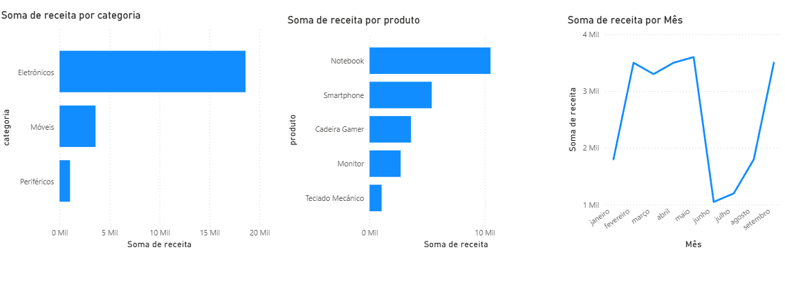

# 📊 Análise de Vendas — SQL · Python · Power BI

Projeto completo de análise de dados construído do zero — desde a modelagem do banco de dados até o dashboard visual.



---

## 🗂️ Estrutura do projeto

```
analise-vendas-sql/
├── dados/
│   └── vendas_completas.csv
├── analise_vendas.py
├── análise_vendas.pbix
├── dashboard.png
└── README.md
```

---

## 🗃️ Banco de Dados

3 tabelas relacionadas:

```
clientes (id_cliente, nome, cidade, estado)
produtos (id_produto, nome, categoria, preco)
vendas   (id_venda, id_cliente, id_produto, quantidade, data_venda)
```

**35 registros de vendas** · **10 clientes** · **10 produtos** · **3 categorias** · **12 meses (2024)**

---

## 🔍 Análises em SQL

### 1. Receita total por produto
> Qual produto gerou mais receita no ano?

**Resultado:** Notebook liderou com R$ 21.000 — quase o dobro do segundo colocado (Smartphone, R$ 12.600).

```sql
SELECT 
  p.nome AS produto,
  SUM(v.quantidade * p.preco) AS receita_total
FROM vendas v
JOIN produtos p ON v.id_produto = p.id_produto
GROUP BY p.nome
ORDER BY receita_total DESC;
```

---

### 2. Receita mensal
> Como as vendas evoluíram ao longo de 2024?

**Resultado:** Junho foi o melhor mês (R$ 8.000). Fevereiro e Julho os piores (R$ 1.910 e R$ 1.600), indicando sazonalidade e oportunidade para ações promocionais.

```sql
SELECT
  strftime('%m/%Y', data_venda) AS mes,
  SUM(v.quantidade * p.preco) AS receita_total
FROM vendas v
JOIN produtos p ON v.id_produto = p.id_produto
GROUP BY mes
ORDER BY data_venda;
```

---

### 3. Ticket médio por categoria
> Qual categoria tem maior valor médio por venda?

**Resultado:** Eletrônicos lideram com ticket médio de R$ 2.540 e 15 vendas. Periféricos têm alto volume (13 vendas) mas ticket baixo (R$ 476).

```sql
SELECT
  p.categoria,
  ROUND(AVG(v.quantidade * p.preco), 2) AS ticket_medio,
  COUNT(v.id_venda) AS total_vendas
FROM vendas v
JOIN produtos p ON v.id_produto = p.id_produto
GROUP BY p.categoria
ORDER BY ticket_medio DESC;
```

---

### 4. Top 5 clientes por valor gasto
> Quais clientes mais contribuíram para a receita?

**Resultado:** Mariana Lima (Curitiba) lidera com R$ 8.700 em 4 compras. Pedro Alves tem o maior ticket médio por visita.

```sql
SELECT
  c.nome AS cliente,
  c.cidade,
  COUNT(v.id_venda) AS total_compras,
  SUM(v.quantidade * p.preco) AS total_gasto
FROM vendas v
JOIN clientes c ON v.id_cliente = c.id_cliente
JOIN produtos p ON v.id_produto = p.id_produto
GROUP BY c.nome, c.cidade
ORDER BY total_gasto DESC
LIMIT 5;
```

---

### 5. Produtos acima da média de receita (Subquery)
> Quais produtos performam acima da média geral?

**Resultado:** Apenas Notebook e Smartphone superam a média de R$ 5.115 — alta concentração de receita em 2 de 10 produtos.

```sql
SELECT
  p.nome AS produto,
  SUM(v.quantidade * p.preco) AS receita_total
FROM vendas v
JOIN produtos p ON v.id_produto = p.id_produto
GROUP BY p.nome
HAVING SUM(v.quantidade * p.preco) > (
  SELECT AVG(receita_por_produto)
  FROM (
    SELECT SUM(v2.quantidade * p2.preco) AS receita_por_produto
    FROM vendas v2
    JOIN produtos p2 ON v2.id_produto = p2.id_produto
    GROUP BY p2.nome
  )
)
ORDER BY receita_total DESC;
```

---

## 🐍 Análise em Python

Usando **Pandas** para replicar e expandir as análises do SQL:

```python
import pandas as pd

# Cruzando tabelas (equivalente ao JOIN)
vendas_completas = vendas.merge(produtos, on='id_produto')

# Calculando receita
vendas_completas['receita'] = vendas_completas['quantidade'] * vendas_completas['preco']

# Receita por categoria (equivalente ao GROUP BY)
receita_categoria = vendas_completas.groupby('categoria')['receita'].sum()

# Exportando para CSV
vendas_completas.to_csv('dados/vendas_completas.csv', index=False)
```

---

## 📊 Dashboard — Power BI

3 visualizações construídas a partir dos dados gerados em Python:

- **Receita por categoria** — gráfico de barras
- **Receita por produto** — gráfico de barras
- **Evolução mensal da receita** — gráfico de linhas

---

## 💡 Principais Insights

- 📦 **Notebook e Smartphone** respondem pela maior parte da receita — diversificação é necessária
- 📅 **Junho** foi o mês de pico — vale investigar o que impulsionou as vendas nesse período
- 👤 **Top 5 clientes** concentram grande parte do faturamento — programa de fidelidade seria estratégico
- 🏷️ **Eletrônicos** têm o maior ticket médio, mas **Periféricos** têm maior frequência de compra

---

## 🛠️ Tecnologias utilizadas

- **SQL** (SQLite)
- **Python** (Pandas)
- **Power BI Desktop**

---

## 📚 Conceitos aplicados

`SELECT` · `JOIN` · `GROUP BY` · `HAVING` · `Subqueries` · `SUM` · `AVG` · `COUNT`
`DataFrame` · `merge` · `groupby` · `sort_values` · `filter`

---

## 👩‍💻 Autora

**Jamilly Oliveira**  
Analista de Dados em formação · Python · SQL · Power BI  
[LinkedIn](https://www.linkedin.com/in/jamilly-oliveira) · [GitHub](https://github.com/jamilly-devs)
